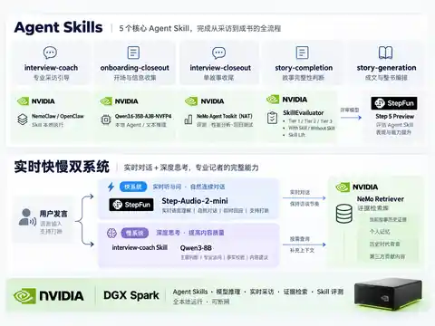
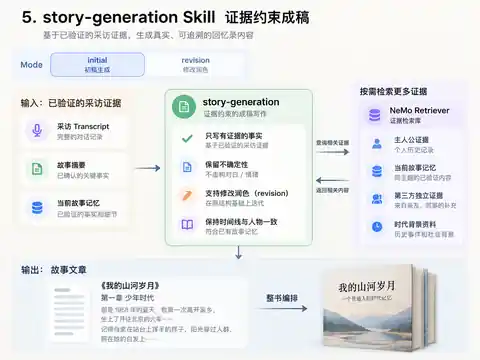

# 人生采访局 · Life Interview

> **一位"会采访的 AI 回忆录记者"：你不需要自己写作，只要跟它聊天，最快 7 天，就能从零完成一部约 10 万字的回忆录成书。**
> 它掌握了口述史专业"听、问、辨、写"四项核心技能，整套系统全部在 NVIDIA DGX Spark 上本地运行，可以断网。

**目录**：① 为什么做 · ② 作品特点与核心亮点 · ③ 评委评分速览 · ④ 核心架构（快慢双系统） · ⑤ Agent Skills 与实测 · ⑥ 证据链 · ⑦ 技术栈与模型优化 · ⑧ DGX Spark 部署 · ⑨ 项目完整性 · ⑩ 技术证据

---

## 1. 为什么做：一个会写作的人，写自己的回忆录都这么难

我岳父一直想把自己这一辈子的经历写下来，留给孩子和后人。他本身是**会写作**的，但整个过程依然特别麻烦：自己写 Word，发给出版社，一遍一遍来回改，前后耗时**一年**，花了大约**两万块**才成书。

最关键的一点是：自始至终没有一个懂传记写作的人告诉他——

> **你这一生还有哪些故事没讲？哪些人很重要？哪些转折还应该继续往下挖？**

如果一个会写作的人写一本回忆录都这么费劲，那**不会写的人怎么办？**

这个需求背后是一个庞大的老年消费群体：据国家统计局数据，2024 年末我国 60 岁及以上人口已突破 **3.1 亿**，占总人口 22%。回忆录出版是一项高度依赖专业性、而且很贵的服务。**人生采访局用 AI 把这项服务变成普通家庭也能使用的产品**：你不需要填任何资料，不需要写一个字，就像和人打电话聊天一样，AI 回忆录记者会不断提问、追问、核对、整理，最后帮你成书。

还有一点我们非常坚持：**回忆录是一个家庭最私密的数据**。整套系统全本地运行、可以断网，意味着父母的人生故事**不出家门、不上任何云**——这既是技术路线，也是产品价值观。

---

## 2. 作品特点与核心亮点

<!-- TODO：在此插入 3~6 张产品真实截图（建议：人生地图 / 实时语音采访界面 / 采访指导包 / 第三方邀请页 / 成稿与 PDF 效果）。
     图片放到 docs/images/ 下，用相对路径引用，例如： -->

- **零门槛开口即用**：第一次使用不需要填任何资料，像打电话一样自然语音聊天，AI 记者会主动探寻你的背景信息；
- **不是固定问卷，是会追问的记者**：它会看"你以前说过什么、这个故事掌握了多少、还有什么没理清"，再决定下一问。比如你提过高考填志愿，它不会只问"报了什么志愿"，而是联动背景继续追："报考时参考了什么资料？为什么选这个专业？"
- **快慢双系统实时采访**：快系统（Step-Audio-2-mini）保证语音对话自然流畅；慢系统（采访教练 + NeMo Retriever）在旁路监听，发现值得深挖的人物、与昨天冲突的事实、可延伸的时代话题，实时指导快系统追问；
- **第三方旁证采访**：支持通过链接邀请家人、朋友、同事补充故事视角；第三方数据与主人公数据**只关联、不融合**，第三方证词不会被写成主人公亲历；
- **AI 自己判断"故事够不够完整"**：每次对话后自动评估缺口——当时最重要的人是谁、真正的转折点是什么、这段经历的影响是什么——并自动规划下一轮采访目标；
- **从故事到成书**：故事完整后由成稿智能体回到原始访谈找回重要细节，按用户选择的撰写喜好完成结构、叙事与润色。几十个故事积累成一部完整回忆录，可导出电子版、印刷装订或出版。

---

## 3. 评委评分速览

| 评分项 | 项目得分点 |
|---|---|
| **实用性 / 行业落地 / 技术创新 · 25%** | 真实痛点驱动（创始人岳父一年两万元成书经历）；用持续语音采访替代"让用户自己写"；快慢系统解决实时自然度与专业追问的根本冲突；证据链避免长访谈事实漂移 |
| **智能体与模型优化技术深度 · 25%** | 6 个正式 Agent Skills；NemoClaw / OpenClaw 智能体执行循环；受限工具调用；NeMo Retriever；结构 / 证据 / 业务规则三层校验；校验修复 / 格式修复；快慢模型分工；SkillEvaluator 实测 +11% ~ +21% |
| **项目完整性 · 20%** | 首次建档 → 故事 → 连续采访 → 第三方旁证 → 采访收尾 → 完整度判断 / 缺口 → 故事成稿 → 成书 / PDF，全链网页产品真实可运行 |
| **平台适配性 · 15%** | DGX Spark GB10 全本地、**断网可用**；Qwen3.6-35B-A3B-NVFP4 + Qwen3-8B + Step-Audio-2-mini + NeMo Retriever + NemoClaw / OpenClaw + NAT |
| **演示效果 · 10%** | 真人连续语音完成首次建档到成稿全链操作；断网验收有正式记录（见第 10 节技术证据） |

**DGX Spark 全本地验证通过，支持断网运行**：文本 / 智能体、Qwen3-8B 采访教练、Step-Audio-2-mini、NeMo Retriever、NemoClaw / OpenClaw、后端 / 网页端、SQLite 均已在 NVIDIA DGX Spark GB10 本地运行；断开外部网络后产品主链仍可使用，真人连续语音操作流畅。



---

## 4. 核心架构：快系统负责自然，慢系统负责专业


```text
用户语音
   ↓
Step-Audio-2-mini 实时语音
   │
   ├──────────────→ 直接自然追问
   │
   └→ interview-coach / Qwen3-8B
          判断：是否需要介入？
             │
          ┌──┴──────────┐
          │             │
     故事记忆       时代背景
       检索            检索
          └──────┬──────┘
              生成指导
                 ↓
           采访指导包
                 ↓
           下一轮自然追问
```

关键优化：

- **判断阶段 ≤ 2 秒，采访教练总时限 ≤ 6 秒**；
- 故事记忆 / 时代背景**按需检索，可并行**；
- 超时、失败或结果过期时全部**失败放行**，不阻塞语音；
- 实时语音、采访教练、文本 / 智能体使用不同模型与接口；
- 长期证据进入 Retriever，不把全部历史塞回语音模型上下文。

---

## 5. Agent Skills：智能体执行循环、工具调用与运行时

项目有 **6 个正式 Skills**。比赛主线是 5 个业务 Skill；`interview-observer` 是辅助实时观察 Skill。

> **名词速记**：OpenClaw 是开源的个人 AI 智能体平台（提供智能体执行循环与工具调用能力）；NemoClaw 是 NVIDIA 官方开源参考栈，一条命令在 DGX Spark 上完成 OpenClaw + OpenShell 安全沙箱运行时 + 开放模型的部署，并为智能体提供隐私与安全护栏。

### 5.1 会后智能体执行循环

```text
后端任务路由
      ↓
任务定义
Skill / 模型 / 超时 / 工具白名单
      ↓
NemoClaw / OpenClaw 智能体
      │
      ├─ 可选工具调用：evidence-search
      │      ↓
      │   NeMo Retriever
      │
      ↓
候选结果
      ↓
结构校验 → 证据校验 → 业务规则校验
      │
      ├─ 拒绝 → 校验修复 / 格式修复 → 重试
      │           （最多 3 次）
      ↓
应用写入
```

四个核心会后 Skill 可在需要时调用各自打包的 `scripts/evidence-search.mjs`；后端控制用户、Story、第三方证据通道、来源白名单、令牌、结果数量与来源信息，智能体不能自行扩大检索范围。

### 5.2 Skill 技术实现与实测

> 表中分数为 NVIDIA SkillEvaluator 对「加载 Skill vs 不加载 Skill」的对比评测得分（独立评审模型 `step-5-preview`）；评测口径、案例集与逐案结果详见第 5.3 节链接的 Tier 3 正式评测报告。

| Skill | 运行时 / 执行循环 / 工具调用 | 实测结果 |
|---|---|---:|
| [**interview-coach**](agent/skills/interview-coach/SKILL.md) | 独立低延迟运行时；**判断 → 可选故事记忆 / 时代背景检索 → 生成指导**；不走通用 OpenClaw 执行循环 | 下一问综合质量 **+55%** |
| [**onboarding-closeout**](agent/skills/onboarding-closeout/SKILL.md) | OpenClaw 智能体执行循环，最多 3 次尝试；可调用工具：`profile / life_stage / related_story` | 0.8163 → **0.9300**（+11.37 个百分点） |
| [**interview-closeout**](agent/skills/interview-closeout/SKILL.md) | OpenClaw 智能体执行循环；按故事 / 第三方模式限定证据检索 | 0.7891 → **0.9500**（+16.09 个百分点） |
| [**story-completion**](agent/skills/story-completion/SKILL.md) | OpenClaw 智能体执行循环；检索当前故事历史证据，验证关键缺口 | 0.7426 → **0.9500**（+20.74 个百分点） |
| [**story-generation**](agent/skills/story-generation/SKILL.md) | OpenClaw 智能体执行循环；可检索访谈原文 / 故事记忆 / 第三方证据 / 时代背景，再生成或修订 | 0.7868 → **0.9600**（+17.32 个百分点） |
| [**interview-observer**](agent/skills/interview-observer/SKILL.md) | 单次本地推理，**1 次尝试 / 0 次工具调用**；后端预取证据 | 0.8157 → **0.9400**（+12.43 个百分点） |

### 5.3 基准评测


**NVIDIA SkillEvaluator Tier 3 项目自测：**

- **5 个 Skill**
- **49 个评测案例**
- **196 次执行尝试**
- **196 / 196 全部成功执行**
- **加载 Skill** 相比 **不加载 Skill**：**约 +11% ～ +21%**
- 独立评审模型：`step-5-preview`（StepFun 阶跃星辰）

详细结果：[NVIDIA SkillEvaluator Tier 3 正式评测报告](docs/07-reports/skills/tier3/2026-09-28/NVIDIA_SKILL_TIER3_REPORT.md)

**实时采访基准评测：**

> 仅实时模型 → 加入 `interview-coach` + NeMo Retriever，**下一问综合质量提升 55%**。

---

## 6. 证据链：让智能体会写，但不能乱写

```text
访谈原文
   ↓
故事记忆 / 摘要
   ↓
完整度判断 / 缺口
   ↓
故事正文
```

- SQLite 是业务**真相源**；
- NeMo Retriever 是可重建的检索层；
- 主人公访谈原文、第三方证据、公共时代背景分离；
- 第三方证词不能自动写成主人公亲历；
- 当前明确纠正优先于历史记忆、摘要和旧稿；
- 智能体候选结果必须经过后端校验后才能落库。

---

## 7. NVIDIA / DGX Spark 技术栈与模型优化

| 技术 / 模型 | 作用 |
|---|---|
| **NVIDIA DGX Spark** | 全本地运行平台 |
| **NemoClaw / OpenClaw** | OpenClaw 智能体平台的 NVIDIA 官方参考栈（含 OpenShell 安全沙箱）：会后智能体运行时、执行循环、Skills 执行 |
| **NeMo Retriever** | 访谈原文 / 故事记忆 / 第三方证据 / 时代背景检索 |
| **NeMo Agent Toolkit (NAT)** | 评测 / 回归 / 性能分析 / 轨迹记录 |
| **NVIDIA SkillEvaluator** | 加载 Skill / 不加载 Skill、Tier 1 / 2 / 3 评测 |
| **Qwen3.6-35B-A3B-NVFP4** | 本地文本推理 / 智能体任务 / 写作 |
| **Qwen3-8B** | 本地低延迟采访教练 |
| **Step-Audio-2-mini**（StepFun 阶跃星辰） | 本地实时语音 |
| **step-5-preview**（StepFun 阶跃星辰） | SkillEvaluator 独立评审模型 |

### 模型与运行时优化

- 实时语音 / 采访教练 / 智能体**按任务拆模型**，避免一个大模型同时承担所有职责；
- 智能体固定上下文由后端预取，减少无意义的工具往返调用；
- 证据检索只在上下文不足或存在冲突时调用；
- 检索采用来源白名单和受限结果数量；
- 智能体最多 3 次尝试，支持运行时重试、校验修复和格式修复；
- Qwen3.6 使用 NVIDIA NVFP4 路线适配 DGX Spark；
- NAT / SkillEvaluator 与产品运行时分离，不增加用户主链延迟。

---

## 8. DGX Spark 部署

全部服务运行在 Spark 本地：

| 运行时 | 接口地址 |
|---|---|
| 文本 / 智能体 | `http://127.0.0.1:8000/v1` |
| 采访教练 | `http://127.0.0.1:8001/v1` |
| Step-Audio-2-mini | `ws://127.0.0.1:8092/realtime` |
| NeMo Retriever | `http://127.0.0.1:7670` |

```bash
git clone https://github.com/gwh7078/life-interview-NVDA.git
cd life-interview-NVDA

cp deploy/spark/env.example deploy/spark/.env

bash deploy/spark/check-env.sh
bash deploy/spark/setup.sh
bash deploy/spark/start.sh
bash deploy/spark/verify.sh
```

仓库负责后端 / 网页端、SQLite、智能体任务协议、Skills、Retriever 集合 / 时代背景索引、NemoClaw / OpenClaw 路由 / 策略、Technical Observer 与验收；已运行的本地文本模型直接被智能体运行时复用，不启动第二份模型。

完整部署说明：[Spark 部署说明](docs/04-nvidia/spark/README.md)

---

## 9. 项目完整性

已实现：

```text
首次建档 / 人生地图
→ 故事创建 / 续访
→ 实时语音采访
→ 第三方补充采访
→ 访谈原文
→ 采访收尾 / 故事记忆
→ 完整度判断 / 缺口
→ 故事生成 / 修订
→ 成书 / PDF
```



同时具备：

- 证据检索 / 时代背景；
- 智能体任务运行时 / 正式 Skills；
- SkillEvaluator / NAT / Technical Observer（技术指标观测与验收）；
- 演示登录、分享链接、版本化故事文档；
- DGX Spark 全本地真人全链验收。

---

## 10. 技术证据

- [整体架构](docs/ARCHITECTURE.md)
- [智能体运行时 / 工具调用循环](docs/AGENT_RUNTIME.md)
- [实时语音 / 采访教练](docs/REALTIME.md)
- [SkillEvaluator 最终审查摘要](docs/07-reports/skills/NVIDIA_SKILL_AUDIT.md)
- [DGX Spark 最终运行验证](docs/07-reports/spark-deployment-evidence-2026-09-29.md)