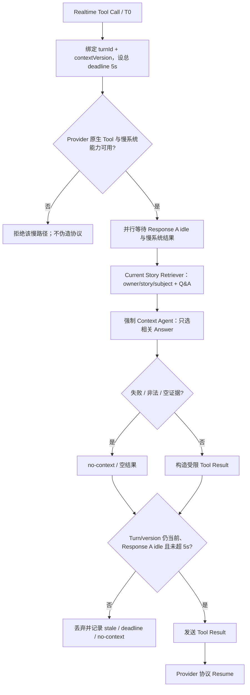

# NVDA Main 快慢系统集成收敛修复报告

日期：2026-09-25  
基线：`gwh7078/life-interview-NVDA` `main@36c307b4418d3c784043f1ba76074b34a71b77c7`  
基线核对：2026-09-25 再次 fetch 后，`origin/main`、本地 `main` 与工作树基线仍相同。最终本地 `main` 提交 SHA 见本轮交付记录。

> **历史快照，已被后续双 Profile 实现取代。** 本文保留的是 `36c307b` 基线上的当时判断；其中 Step-Audio-2-mini Retired、MiniCPM Candidate、`supportsSlowContext` 及“Tool timeout 不发送 Tool Result”均不是当前状态。当前实现与验收以 [Realtime 双 Profile 与独立 Memory 报告](REALTIME_DUAL_PROFILE_MEMORY_REPORT_v1.0.md) 为准。

## 结论

慢系统边界、5 秒总 deadline、no-context 失败策略、Q+A 事实来源、Provider capability 和技术观测已收敛。MiniCPM-o-4.5-Realtime 仍是 **Candidate**，本轮不能标为 Accepted：OpenBMB 公开 Realtime API 文档没有定义原生 Tool Calling、Tool Result 与 Resume 协议；真实 MiniCPM E2E 也没有运行。没有用文本解析、提示词约定或客户端猜测补造协议能力。

## 1. 修改内容

### Realtime / 慢系统

- `REALTIME_SLOW_DEADLINE_MS` 默认改为 `5000`，配置上限也限制为 5000 ms。deadline 从 Tool Call 到达时开始计时，包含 Retriever、Agent、Tool Result 准备和发送；内部慢工作提前结束，为结果写入留出时间。
- Tool Call 记录 `turnId` 与 `contextVersion`，Coordinator 另有 generation/runId。Turn 或版本变化、取消、超时后的结果均丢弃；检查 Response A 是否 idle 与慢工作并行，并受同一 deadline 约束。
- Retriever 或 Agent 失败、Agent 不可用、输出非法、证据为空时返回 no-context；Retriever 原始结果不会直达 Realtime。只有结果仍属当前 Turn、Response A 已 idle 且 deadline 未到，才写 Tool Result 并 Resume。
- 若 Response A 到 deadline 仍未 idle，丢弃本轮结果并记录 `slow.no_context`，不再制造 Response B。此时不发送 Tool Result；安全恢复仍依赖 Provider 协议，见 Blockers。
- 删除慢 Agent 的 `recentFinalMessages`、recent messages 和 summary 输入。Agent 输入只含 query、story/subject ID 与限长 Q+A evidence；question 仅供理解语境，返回事实由被选中 evidence 的 User Answer 重建。
- Retriever 完成本地 metadata scope filter 后再按调用方 `topK` 截断，恢复 generic contract。

### Provider 与 VAD

- Provider capability 明确包含 `supportsToolCalling`、`supportsSlowContext`、`supportsExplicitTurnRequest`、`supportsInterrupt`、`manualTurnControl`、`supportsExplicitSessionClose` 等能力。Server 通过能力字段决策，不按 Provider 名称控制 VAD 或慢系统。
- ModelBest 使用 OpenBMB 文档的 Realtime URL 和 audio mode；音频按官方格式在浏览器 PCM16 与服务端 Float32 之间转换。没有增加官方文档未定义的 Tool Calling。
- 无显式 Provider 配置时，服务端、会话层和 UI 默认路由到 MiniCPM Candidate。显式 StepFun 配置仍可走兼容 Adapter；当前忽略的本地 `.env` 明确设置了 `STORY_INTERVIEW_PROVIDER=stepfun`，且未配置 `MODELBEST_API_KEY`，本轮没有覆盖该用户本地配置。
- 通用 `scripts/real-provider-e2e.ts` 已支持选择 MiniCPM、校验其独立凭证并读取对应模型名；脚本本轮未运行，因为该 Worktree 没有 `MODELBEST_API_KEY`。
- Local VAD controller 与 VAD Web 资源保留；只有 `manualTurnControl=true` 时才走手动回合控制。通用 Server 错误不再写死 StepFun 名称。通用 Tool 名称移到 Realtime contract 层。

### 观测与文档

Realtime trace 与 Tech Observer 现在映射这些慢链路事件：

- `realtime.tool_call.received`
- `slow.retriever.started` / `slow.retriever.completed` / `slow.retriever.failed`
- `slow.agent.started` / `slow.agent.completed` / `slow.agent.failed`
- `slow.no_context` / `slow.deadline.exceeded` / `slow.result.stale_dropped`
- `realtime.tool_result.sent` / `realtime.response.resumed`

记录阶段耗时 `retriever_ms`、`agent_ms`，以及 `total_slow_ms`、`hold_ms`。NAT 继续留在评估与观测层，不编排业务流程。

同步更新了环境说明、Provider/Slow System 状态、历史 StepFun/VAD 验收页、Feature Matrix 与本报告；`REALTIME_CONTEXT_AGENT_ENABLED=0` 和 `NEMO_RETRIEVER_ENABLED=false` 默认值未改。

## 2. 旧路径处置

| 路径 | 当前处置 |
|---|---|
| Step-Audio-2-mini 默认 Realtime 路由 | 已移除；标为 **Retired / no longer target realtime provider**。 |
| StepFun Adapter、协议解析、历史 E2E 脚本 | 作为显式 legacy compatibility 保留；不再是默认 Provider，也未继续优化模型指令遵循。 |
| StepFun `manual_turn_started` / `manual_turn_commit` | 留在旧协议 Adapter；主链只看 `manualTurnControl` capability。 |
| Local VAD 与 `vad-web` | 保留为 Provider-neutral 组件；当前候选 Provider 是否采用 VAD 尚未实测。 |
| `recentFinalMessages` 与慢 Agent recent transcript payload | 删除。 |
| Retriever raw fallback | 删除；Agent 不可用/失败只返回 no-context。 |
| `realtime.tool_result_deferred` | 删除。Response A 未 idle 时记录 no-context 并丢弃结果，不创建第二个 Response。 |
| `get_interview_context` | 名称保留为通用 Realtime Tool contract，不再由 Server 引用 StepFun 常量。 |

## 3. MiniCPM 实际能力核对

依据 [OpenBMB 官方 MiniCPM-o Realtime API 文档](https://github.com/OpenBMB/MiniCPM-o-Demo/blob/main/docs-app/content/docs/en/realtime-api/overview.md)：

| 能力 | 官方协议 / 本地 Adapter 状态 | E2E 状态 |
|---|---|---|
| 音频 Realtime 与 PCM | 文档定义 `session.init`、`input.append`、listen/text/audio 输出 delta、`session.close`；输入 16 kHz mono Float32，输出 24 kHz mono Float32。 | Provider 转码有确定性测试；真人语音未测。 |
| 首问主动开口 | 文档未保证仅 `session.init`、用户静默时必然开始回应；Adapter 无显式 response 请求。 | **NOT TESTED** |
| Tool Calling | 文档未定义 `tools` / function calling 或工具调用事件。Adapter `supportsToolCalling=false`。 | **BLOCKED / NOT TESTED** |
| Tool Result 与 Resume | 文档未定义 Tool Result、继续同轮回应的事件或协议。Adapter `supportsSlowContext=false`。 | **BLOCKED / NOT TESTED** |
| Interrupt | 公开协议没有定义本项目可用的显式中断/取消事件。Adapter `supportsInterrupt=false`。 | **NOT TESTED** |
| 显式回合请求 / manual turn | 文档未定义 `response.create` 或手动 VAD commit；对应能力均关闭。 | **NOT TESTED** |
| Session close | 文档定义 `session.close` / `session.closed`；Adapter 支持显式关闭。 | 仅协议映射测试；真人 Closeout 未测。 |

ModelBest 目前显式声明 `fullDuplex=true`、`supportsExplicitSessionClose=true`；不声明未证实的 Tool、Slow Context、Interrupt 或 Turn Request 能力。公开文档未描述某项能力不等同于服务端绝对不存在，但在官方协议和真实验证补齐前，本项目不会调用或模拟它。

## 4. 最终慢系统状态机

Tool Result 发送由 Adapter 的正式协议能力决定。Response A 未 idle 时不发送可能导致双 Response 的结果；MiniCPM 缺少公开 Resume 协议，因此它当前不会进入这条慢链路。

## 5. 验证结果

| 类别 | 结果 |
|---|---|
| TypeScript typecheck | **PASS** |
| Slow pipeline / Retriever contract targeted | **PASS 41/41**：强制 Agent、no raw fallback、最小 payload、Q+A scope、topK、deadline/stale。 |
| Provider / Observability targeted | **PASS 39/39**。 |
| 默认路由 / Session / 页面 targeted | **PASS 9/9**。 |
| `test:fast` | **FAIL 221/222**。唯一失败 `test/story-share.test.ts:99` 断言 prompt 包含“不是主人公本人”；该测试与 `src/realtime/prompt.ts` 本轮均未修改，且两者与基线相同。不是本轮 Realtime diff 引起；本报告不改无关 contributor prompt 来掩盖。 |
| `test:integration` | **PASS 63/63**，含 Realtime Tool/slow-path wiring、结束与业务持久化集成覆盖；这些测试使用受控依赖，不代表真实 MiniCPM E2E。 |
| `test:agent` | **PASS 37/37**。 |
| NAT unit | **PASS 8/8**。 |
| `scripts/check-ai-env.sh` | **PASS 2026-09-25**：Retriever、VectorDB、OpenClaw forward 与 Codex MCP 可达。Health check 不证明实时数据检索正确。 |
| Realtime Context Agent live smoke | **FAIL**：`AGENT_RUNTIME_TIMEOUT`。真实 Agent 未完成本轮 smoke。 |
| MiniCPM 首问 / 5 轮多轮 / 原生 Tool Calling / 完整 Retriever→Agent→Result→Resume / 真实 5 秒与 stale E2E / MiniCPM Closeout | **NOT TESTED**；未配置 `MODELBEST_API_KEY`，并受官方 Tool/Resume 协议未文档化阻塞。 |

E2E 4–8 的 no-context、超时丢弃、stale drop、Q+A Answer 来源和不含 recent transcript 均有 deterministic / integration contract 覆盖；它们不是 MiniCPM 真实语音 E2E。普通 Story 结束/持久化有受控 integration 覆盖；MiniCPM 完整 Closeout 未测试。

## 6. 未解决 Blocker

1. **原生 Tool Calling / Resume 协议**：公开 MiniCPM API 文档未定义。已向产品负责人请求选择替代架构；未得到选择前不改为 prompt 解析、客户端猜测或其他模型。MiniCPM 仍为 Candidate。
2. **Realtime Agent 性能**：本轮真实 smoke 超时；在 5 秒总预算内完成 Retriever + Agent 的真实链路尚未证明。没有更换 Agent 模型。
3. **真实 Provider E2E 条件**：当前工作树没有 `MODELBEST_API_KEY`；ignored `.env` 仍显式指定 StepFun。未覆盖本地环境或注入密钥。
4. **Response A 安全恢复**：若 Provider 到 deadline 仍未报告 Response A idle，服务器丢弃结果以避免并行 Response；MiniCPM 没有已证实的取消或最小 Tool Result 恢复协议。
5. **既有 fast 测试失败**：contributor prompt 断言与当前 prompt 不一致，源文件与断言均未进入本轮变更；需独立决定是否修正该旧断言/产品文案。

## 7. 提交状态

本报告记录以 `36c307b4418d3c784043f1ba76074b34a71b77c7` 为基线的本轮实现与验证。代码及文档最终经过 diff review 后合入本地 `main`；最终提交 SHA 在本轮交付消息中给出。未推送远端。
